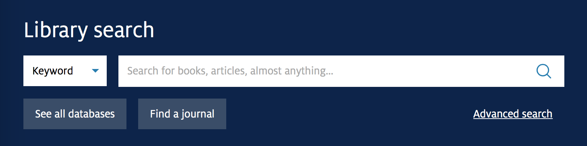

# UA Libraries - Primo search

Search Primo from within the main library website

## Getting started

1. Clone this repository
2. Run `npm install`

Build for production by running `npm run build`.

Develop locally by running `npm run watch`. A development server will be started locally on port 5000.

## Configuration

Some configuration details are stored in `app.config.js`.

* `domain`: The Primo instance to use
* `institution`: The Ex Libris institution code
* `vid`: The Ex Libris view ID

## Licensing

Copyright (C) The Arizona Board of Regents on Behalf of the University of Arizona - All Rights Reserved
